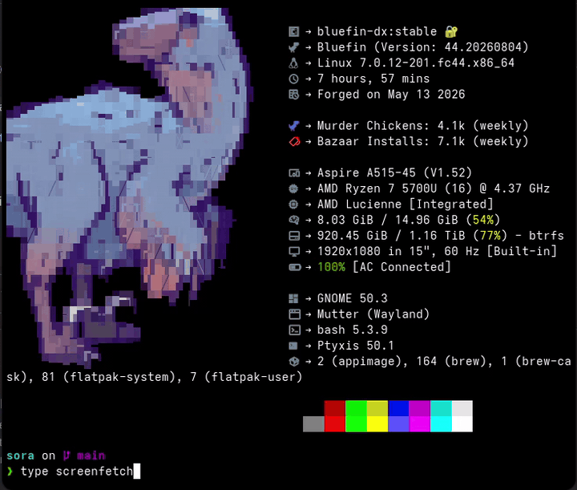

# sora

**Digite um comando que só existe dentro de um container distrobox, e ele
simplesmente roda — com os binários do host sempre vencendo.**

[Read in English](README.md)

Em distros imutáveis/atômicas (Fedora Silverblue, Bluefin, Bazzite, Aurora,
openSUSE MicroOS, Vanilla OS) suas ferramentas vivem em containers distrobox —
e você paga por isso a cada invocação: `distrobox enter archbox -- neofetch`,
de novo e de novo. O ecossistema resolveu a direção **container → host**
(`distrobox-host-exec`, `host-spawn`); o sora resolve a direção oposta,
**host → container**:

```console
$ sora box create archbox --image arch
$ sora hook install
$ neofetch            # não existe no host — roda da archbox, transparente
$ sora anxious --sudo pacman --box archbox
$ pacman -S steam     # funciona de scripts, .desktop, cron, qualquer lugar
```

Sem daemon, sem poluir o PATH, e um typo nunca acorda um container.



*Acima: `neofetch` resolve no host (o host sempre vence); `type screenfetch`
não conhece nada — mas executá-lo despacha para a box ubuntu de forma
transparente; o typo `screenfetc` falha na hora sem acordar container; e
`sora which screenfetch` mostra como um comando resolveria.*

## Instalação

```sh
# Recomendado: installer verificado (checa o sha256 da release, instala em ~/.local)
curl -fsSL https://raw.githubusercontent.com/LLawli/sora/main/packaging/install.sh | sh

# Tarball, na mão (fallback)
curl -fsSL https://github.com/LLawli/sora/releases/latest/download/sora-0.1.0.tar.gz | tar xz
make -C sora-0.1.0 install PREFIX=~/.local

# mise
mise use -g github:LLawli/sora

# Homebrew (host Linux ou macOS gerenciando boxes remotas)
brew install LLawli/tap/sora
```

Requisitos: `distrobox` e `podman` (ou docker). Shell puro — nada para
compilar, nenhum runtime, `noarch` em qualquer lugar. Deliberadamente **não
há pacotes nativos de distro** (COPR/AUR/deb/rpm): para um único shell
script eles adicionam filas de revisão e manutenção sem benefício — veja
[docs/decisions.md](docs/decisions.md). Depois, uma vez:

```console
$ sora hook install        # bash, zsh e fish
```

## Duas estratégias complementares

O sora implementa **os dois** modelos de propósito, porque nenhum cobre o
território do outro:

1. **Resolução tardia** (o diferencial). Nada é exportado. A busca no PATH
   falha, e o gancho de "comando não encontrado" do shell resolve a falha
   consultando um índice `comando → box` em cache. Consequência importante:
   **a precedência do host é estrutural** — o gancho só roda *depois* que o
   PATH do host já falhou, então nada jamais sombreia um binário do host.

2. **Exportação ansiosa sob demanda** (`sora anxious`). Um wrapper real é
   colocado no PATH para um comando específico, via `distrobox-export` por
   baixo. Cobre todos os contextos que o gancho tardio não alcança.

| | Resolução tardia | Exportação ansiosa |
|---|---|---|
| Contextos que funcionam | só shells interativos com o gancho instalado | qualquer um: scripts, `.desktop`, cron, outro shell |
| Tab completion | sim, veja abaixo (bash e zsh; fish reduzido) | sim, mais o gerador da própria ferramenta |
| Cobertura | todos os binários da box, automático | um comando por vez, explícito |
| Poluição do PATH | nenhuma | um arquivo por comando exportado |
| Precedência do host | estrutural (gancho só dispara após o PATH falhar) | imposta: export que sombrearia binário do host é recusado |

**Por que não simplesmente exportar tudo?** Uma box tem milhares de binários.
Exportar todos inunda o PATH e o tab completion, inverte a precedência em
qualquer colisão de nome, e deixa wrappers órfãos a cada pacote removido.
**Por que o índice em cache?** Os handlers ingênuos que circulam mandam
*toda* palavra desconhecida para o container — um typo como `gti status`
acorda um container parado só para falhar de forma confusa. No sora, o erro
custa microssegundos, nunca toca no container, e a existência do container é
verificada antes de despachar.

## Uso

### Boxes

```console
$ sora images                                  # catálogo de aliases (qualquer imagem OCI serve)
$ sora box create archbox --image arch
$ sora box list
$ sora box enter archbox
$ sora box rm archbox [--delete-home]
```

O `sora box create` aplica dois defaults opinativos, ambos desligáveis:

- **Home própria** por box (`~/.local/share/sora/homes/<box>`, desligue com
  `--no-own-home`). Isso é *organização*, não isolamento: evita que pacotes
  instalados na box espalhem dotfiles na home do host. A home do host continua
  bind-montada no mesmo caminho absoluto de qualquer jeito — `--home` troca o
  `$HOME`, não esconde nada. Para esconder subcaminhos sensíveis de verdade,
  use `--hide` (tmpfs por cima): `--hide .ssh --hide .gnupg`.
- **Symlinks das pastas XDG** da home da box para as pastas reais do host
  (desligue com `--no-xdg-links`), resolvidas com `xdg-user-dir` porque as
  pastas são localizadas ("Documentos", "Imagens"…).

Os metadados ficam em `~/.config/sora/boxes/<box>.toml`: imagem de origem,
família do gerenciador de pacotes (detectada pela **presença do binário**
dentro da box, nunca adivinhada pelo nome da imagem; sobrescrevível com
`--pkg-manager`), home da box, prioridade no índice, data da última indexação.

### O índice

```console
$ sora reindex [box...]        # reconstrói (create/rm/pin já fazem isso)
$ sora conflicts               # comandos em >1 box, e quem vence
$ sora pin python archbox      # fixação manual, vence a prioridade
$ sora which python            # como um comando resolveria (host vs box)
$ sora box set-priority archbox 50
```

Ordem de resolução para um comando presente em várias boxes: **pin → maior
prioridade → nome alfabético da box** (determinístico). O índice se atualiza
sozinho: o `sora box create` instala um hook *dentro* da box usando o
mecanismo nativo do gerenciador (plugin de actions do dnf5, `DPkg::Post-Invoke`
do apt, hook ALPM do pacman), então toda transação reescreve o índice do
host. Outros gerenciadores (zypper, apk, …) exigem `sora reindex <box>`
manual — o sora avisa na criação.

### `sora anxious` — exportação ansiosa

```console
$ sora anxious --sudo pacman --box archbox
$ sora anxious htop --box fedora
$ sora anxious --list
$ sora anxious --remove pacman
```

Os wrappers vão para `~/.local/bin`, gerados pelo `distrobox-export` por
baixo.

**Semântica do `--sudo` — leia, todo mundo erra isso.** O wrapper roda o
comando com `sudo` **dentro** do container (o distrobox já configurou
`NOPASSWD` lá). É isso que permite digitar `pacman -S steam` direto no
terminal do host, **sem** `sudo` na frente. Colocar `sudo` do host antes
quebraria tudo: miraria o storage *rootful* do podman em vez dos seus
containers rootless.

Gerenciadores de pacotes são o caso de uso principal do modo ansioso
justamente porque são invocados de scripts e de contextos onde a resolução
tardia não vale.

**Exportar algo que não está no PATH da box.** Binário de integração quase
nunca está: ferramenta de fornecedor cai em `/opt`, e o `anxious` resolve
*nome* de comando. O `--path` pega o binário direto e o `--as` dá o nome do
export:

```console
$ sora anxious --path /opt/lacuna-webpki/webpki --as webpki-lacuna --box adv-br
```

O `--as` funciona sozinho também, quando o nome que a box dá para algo não é o
nome que você quer no host.

**Export que sombrearia binário do host é recusado.** "O host sempre vence" é
*estrutural* na resolução tardia (o gancho só dispara depois que o PATH já
falhou), mas a exportação ansiosa escreve arquivo de verdade em `~/.local/bin`,
que costuma vir antes de `/usr/bin`. Então o sora confere antes e para:

```console
$ sora anxious fd --box archbox
sora: warning: 'fd' already exists on the host: /usr/bin/fd
sora: warning: ~/.local/bin usually precedes /usr/bin, so this export would shadow it
sora: warning: pick another name with --as, or pass --force to shadow it deliberately
sora: error: refusing to shadow a host binary
```

A checagem não custa nada e roda antes de qualquer container ser tocado.

### `sora anxious --desktop` — apps gráficos no menu

Um app gráfico dentro de um box precisa de mais que um wrapper: precisa de um
`.desktop`, de um ícone que o host consiga enxergar e, no caso de um
navegador, dos tipos MIME que permitem virar handler padrão.

```console
$ sora anxious --desktop chromium --box archbox
sora: found an entry inside 'archbox': Chromium
sora: name shown in the menu [Chromium]:
sora: generic name (e.g. Web Browser) [Web Browser]:
sora: one-line description [Access the Internet]:
sora: icon name inside the box [chromium]:
sora: menu categories [Network;WebBrowser;]:
sora: MimeType (empty for none) [text/html;x-scheme-handler/http;...]:
sora: search keywords [web;browser;]:
sora: imported 9 icon file(s) as 'sora-chromium'
sora: wrote ~/.local/share/applications/sora-chromium.desktop
sora: make 'Chromium' the host's default web browser? [y/N]
```

Todo valor padrão sai primeiro do `.desktop` que já existe dentro do box, ou
seja: para um app empacotado é Enter, Enter, Enter. As perguntas só viram
perguntas de verdade no caso que o `distrobox-export --app` simplesmente não
atende: um app que **não** traz `.desktop` nenhum (instalação por tarball,
AppImage, navegador jogado em `/opt`).

Toda pergunta também é flag, então a mesma coisa funciona em script:

```console
$ sora anxious --desktop chromium --box archbox --no-prompt \
    --name Chromium --browser --default-browser
```

`--name`, `--generic-name`, `--comment`, `--icon`, `--categories`, `--mime`,
`--keywords`, `--wmclass`, `--terminal`, `--browser`, `--default-browser`,
`--detect-wmclass`, `--no-prompt`. Sem tty, o sora assume os padrões em vez de
travar esperando resposta.

**O que isto faz e o `distrobox-export --app` não faz:**

- **Funciona sem `.desktop` no box.** O `distrobox-export` precisa de uma
  entrada existente para copiar; aqui ela é construída a partir das respostas.
- **`Exec=` é o wrapper do anxious**, em caminho absoluto. Sem prefixo
  `distrobox enter`, sem dança de aspas em volta dos códigos `%U`, e como o
  wrapper funciona em qualquer contexto o app fica elegível a handler padrão.
- **`Icon=` continua sendo um nome.** Todo tamanho encontrado no box é
  extraído para `~/.local/share/icons/hicolor/*/apps/sora-<cmd>.*`, então o
  tema de ícones continua escolhendo resolução e variante escura. O
  `distrobox-export` fixa um arquivo absoluto e perde as duas coisas.
- **`MimeType` é configurável**, que é o único jeito de um navegador dentro do
  box virar o handler de `http`/`https` do host. O `--browser` preenche isso e
  oferece rodar o `xdg-settings`.
- **`StartupWMClass` é herdado, não chutado.** O `distrobox-export` escreve o
  nome que você digitou; quando esse nome está errado (o Chromium reporta
  `Chromium-browser`), a dock mostra um segundo ícone genérico em vez de
  agrupar a janela com o lançador. O sora pega o valor da entrada do box e, só
  quando não existe nenhum, oferece abrir o app uma vez para ler a classe da
  janela real.

A detecção de classe de janela depende de um compositor disposto a dizer o que
está na tela: X11/XWayland via `xprop`, Hyprland via `hyprctl`, sway via
`swaymsg`. O GNOME no Wayland não expõe nada, então lá ele avisa para você
descobrir a classe e passar `--wmclass`.

O `sora anxious --remove <cmd>` leva junto a entrada e todos os ícones
importados, e o `sora box rm` faz o mesmo para tudo que aquele box fornecia:
um lançador apontando para container removido é pior que lançador nenhum.

### `sora provide` — publicar um recurso da box para o host

Boa parte do que se quer de uma box nunca é digitada por ninguém: é procurada
por um programa do host num ponto de integração próprio. O NSS procurando um
módulo PKCS#11, o navegador procurando um assinador, o desktop procurando um
handler de MIME. A forma é sempre a mesma (um arquivo de configuração do host
cujo campo "execute isto" aponta para algo que entra na box) e só o formato do
arquivo muda. O `anxious --desktop` é o primeiro adaptador dessa forma; o
`provide` é a forma geral.

Hoje ele implementa PKCS#11: driver de token/cartão instalado **só dentro da
box**, usável pelos navegadores do host.

```console
$ sora provide pkcs11 /usr/lib/libaetpkss.so --box adv-br --label safesign
sora: wrote ~/.config/pkcs11/modules/sora-adv-br-safesign.module
sora: registered /usr/lib64/p11-kit-proxy.so in ~/.pki/nssdb as sora-p11-kit-proxy
sora: the host's p11-kit sees module 'sora-adv-br-safesign'
sora: restart Chromium/Brave/Chrome for them to pick up the module

$ sora provide list
$ sora provide remove sora-adv-br-safesign
```

Nada é instalado no host. Funciona porque o p11-kit tem *remoting* desde 2017,
feito para encaminhar token por SSH: a configuração de um módulo pode nomear um
comando que fala o protocolo por stdin/stdout em vez de uma biblioteca local.
Trocar `ssh` por `distrobox enter` é o truque inteiro. Não há daemon nem
socket: o p11-kit inicia o comando sob demanda e ele morre junto com quem o
usou.

O `--no-nss` pula o registro em `~/.pki/nssdb`, que é o que faz Chromium, Brave
e Chrome enxergarem o módulo (o Firefox tem banco próprio por perfil). Esse
registro é singleton: é escrito uma vez só, não importa quantos módulos você
publique, e é removido quando o último sai. O sora não mexe em proxy do p11-kit
que ele não registrou.

O segundo adaptador cobre a outra metade do problema do token:

```console
$ sora provide native-messaging com.lacunasoftware.webpki --box adv-br
```

Um assinador de navegador não é biblioteca carregada no navegador: é um
programa separado que o navegador executa e com quem conversa por
stdin/stdout. Então se ele roda dentro da box, usa o driver de lá, e ao
navegador do host basta saber como executá-lo. O sora copia o manifesto de
dentro da box e reescreve **só** o campo `path` para apontar para um wrapper
exportado; o `allowed_origins` amarra o manifesto no ID da extensão e não pode
ser inventado, e é por isso que o arquivo é copiado e não construído. Todo o
resto é preservado byte a byte, e isso é verificado antes de cada arquivo
entrar no lugar.

**Os dois adaptadores resolvem problemas diferentes e você provavelmente quer
os dois.** O `pkcs11` é para *autenticação* por certificado, em que o próprio
navegador carrega o módulo (Projudi, eproc, login do PJe, gov.br). O
`native-messaging` é para *assinatura*, em que quem trabalha é um programa
separado.

Para navegador Flatpak o sora escreve um shim com `flatpak-spawn` dentro da
árvore de config do próprio app e aponta o manifesto para ele: navegador
Flatpak executa o `path` **dentro do sandbox**, onde o distrobox não existe,
então caminho de host pelado simplesmente nunca funciona. O sora imprime o
único comando `flatpak override` de que esse shim precisa e deixa a execução
com você.

**No que isso não pode virar.** Não vira "usar qualquer `.so` da box". O
PKCS#11 é remotável por um acidente feliz de projeto (tabela de funções estável
e de granularidade grossa, sem callbacks, com propriedade de memória definida)
e, mesmo assim, alguém teve que escrever o marshalling à mão, função por
função. A generalização correta é para cima, no ponto de integração, não para
baixo na ABI. Veja [docs/rfc-provide.md](docs/rfc-provide.md).

**Segurança.** Publicar um recurso da box dá a qualquer aplicativo do host o
mesmo acesso que ele teria se o recurso fosse local. É equivalente, não pior,
mas vale dizer, porque quem usa container costuma esperar o contrário.

### Tab completion

O próprio comando `sora` se completa desde a instalação: subcomandos, flags,
nomes de box no `--box`, comandos indexados no `which` e no `pin`, comandos
exportados no `anxious --remove`. Vai para o diretório padrão de cada shell
pelo `make install` e pelo installer, e lê só arquivos locais, então completar
um comando do sora também nunca entra em container.

Para os comandos *dentro* das boxes, completion são dois problemas distintos, e
o sora trata cada um do seu jeito.

**O nome do comando** (`kubect<Tab>`). O shell monta essa lista a partir do
PATH, então um comando que só existe dentro de uma box nunca aparece. O sora
mescla o índice aos candidatos: `complete -I` no bash, um completer extra no
zsh. É uma passada de awk sobre um arquivo plano, ou seja, **completar um nome
nunca toca em container**, igual a um miss. Não precisa configurar nada, vem
junto com o gancho.

**Os argumentos** (`apt-get inst<Tab>`). Quatro mecanismos, complementares e
não concorrentes, porque a cobertura de cada um é diferente:

| | O que cobre | Custo por Tab | Configuração |
|---|---|---|---|
| Scripts sincronizados | software que já traz script de completion (a maior parte de uma distro) | zero, para scripts estáticos | automático no `sora reindex` |
| Gerador da própria ferramenta | ferramentas cobra / clap / click | ~300 ms | `sora anxious <cmd> --box <box> --with-completion` |
| Delegação viva | qualquer coisa, com o estado vivo da box | ~300 ms, sempre | `sora completion delegate <cmd> --box <box>` |
| carapace-bin | ~1600 ferramentas conhecidas | ~300 ms | instalar o carapace; sem configuração no sora |

```console
$ sora completion status                              # o que está ligado
$ sora completion delegate systemctl --box archbox    # opt-in de completion viva
$ sora completion list | remove <comando>
```

O `sora reindex` copia os scripts de completion de cada box para
`~/.local/share/sora/completions/`, elegendo um vencedor por comando com as
mesmas regras de prioridade e pins do índice. Assim um comando pinado nunca
despacha para uma box e completa a partir de outra. Nada é escrito no seu
diretório do `bash-completion`: o sora encadeia o loader dinâmico do
bash-completion, então não tem como sobrescrever um arquivo seu.

A delegação viva é opt-in por comando porque entra no container a **cada**
Tab. Com a box parada, esses Tabs não devolvem nada, em vez de congelar o
terminal por três segundos para acordá-la.

O [carapace-bin](https://carapace-sh.github.io/carapace-bin/) não precisa de
código de suporte: as specs dele descrevem a ferramenta, não o caminho dela,
então os shell-outs caem no wrapper ou no gancho do sora como qualquer comando.

**O suporte do fish é reduzido, e isso não tem conserto do lado do sora.**
Dentro de uma substituição de comando, o fish descarta a saída de um comando
desconhecido mesmo quando o `fish_command_not_found` roda e imprime com
sucesso (o bash devolve o valor ali; o fish não devolve nada). Então, para um
comando de resolução tardia, a metade *estática* de uma completion
sincronizada funciona, e tudo que faz shell-out para calcular candidatos
devolve vazio silenciosamente. Delegação viva e completion do nome do comando
são só bash e zsh. O que funciona no fish: exportar o comando com
`sora anxious --with-completion`. Um wrapper é um arquivo real no PATH, não um
comando desconhecido, então nada é descartado.

### Ganchos de shell

```console
$ sora hook install [bash zsh fish]
$ sora hook status
$ sora doctor                  # checagem geral do setup
```

**Encadeamento é inegociável.** O gancho de comando-não-encontrado costuma já
estar ocupado (`mise`, `pkgfile`, `command-not-found` do Debian, PackageKit
no Fedora). O sora nunca o sobrescreve — salva o handler anterior e delega a
ele sempre que não resolver sozinho. Carregue o gancho do sora **depois**
dessas ferramentas (o instalador anexa ao final do rc). Quando o sora não
resolve, a mensagem distingue "nenhuma box indexada" de "o comando não existe
em nenhuma box". Argumentos (espaços, aspas, strings vazias) chegam intactos;
o código de saída é propagado.

## Limitações, honestamente

- Resolução tardia exige shell interativo com o gancho instalado — é
  exatamente por isso que o `sora anxious` existe.
- O fish força o status *reportado* de um comando desconhecido para 127 mesmo
  quando o handler o executou com sucesso; o comando roda e imprime
  normalmente, só o `$status` mente. bash e zsh propagam corretamente.
- O mesmo comportamento do fish, um nível mais fundo, é o que limita o tab
  completion lá: dentro de uma substituição de comando o fish joga fora a
  saída inteira de um comando desconhecido, então completions que fazem
  shell-out não recebem nada. Veja a seção de tab completion;
  `sora anxious --with-completion` é o caminho para contornar.
- Completar o *nome* de um comando exige bash 5.0+ (`complete -I`). No bash 4
  o gancho continua resolvendo comandos; só a completion de nome é pulada.
- A fidelidade de argumentos através do `distrobox enter` é a da sua versão
  do distrobox; o sora passa `"$@"` intocado.
- No fish, o sora instala em `conf.d`, que carrega *antes* do `config.fish`;
  se outra ferramenta define o handler no `config.fish`, carregue o sora no
  final do `config.fish` para que ele possa encadear.

## Para contribuidores

Detalhe de implementação fica deliberadamente fora deste README (em inglês):

- [docs/architecture.md](docs/architecture.md) — fluxo de dados, formatos em
  disco, scripts gerados, e as seis armadilhas que o código encapsula
  (permissões keep-id/subuid, sudo resetando `$HOME`, quoting de heredoc…).
- [docs/decisions.md](docs/decisions.md) — por que bash, por que não um
  usuário de sistema dedicado, por que não um shim de PATH, por que não
  exportar tudo, prior art.
- [docs/rfc-provide.md](docs/rfc-provide.md) — o desenho por trás do `sora
  provide`: por que um comando com adaptadores, por que o PKCS#11 é remotável e
  um `.so` qualquer não é, as medições e as armadilhas. O PKCS#11 está pronto;
  o adaptador de native messaging ainda é proposta.
- [docs/releasing.md](docs/releasing.md) — releases por tag, `bin/release`.
- [CONTRIBUTING.md](CONTRIBUTING.md) — o que o CI impõe.

```console
$ make test           # suíte em sandbox, stubs de distrobox/podman
$ make lint           # shellcheck, estrito
$ make integration    # opt-in: cria uma box real descartável
```

## Licença

[MIT](LICENSE)
